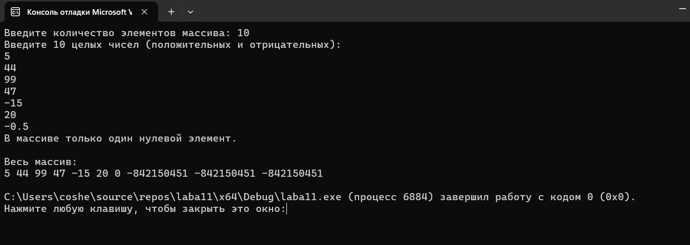

# Домашнее задание к работе 11
## Условие задачи
2. количество элементов массива, расположенных между первым и последним нулевыми элементами.

### Алгоритм
1.Начало - точка входа в программы
2.Ввод данных - получение размера массива и его элементов
3.Проверки - валидация входных данных и выделенной памяти
4.Поиск нулей - два последовательных поиска (с начала и с конца)
5.Логика вычислений - проверка наличия двух разных нулевых элементов
6.Вывод результатов - в зависимости от наличия нулей в массиве
7.Завершение - освобождение памяти и завершение программы
8.Вывести результат
Конец программы
### Блок-схема

## 2. Реализация программы:
      #define _CRT_SECURE_NO_WARNINGS
      #define _USE_MATH_DEFINES
      #include <locale.h>
      #include <stdio.h>
      #include <stdlib.h>
      #include <string.h> 
      #include <conio.h>
      #include <math.h>
      #include <time.h>
      int main() {
          setlocale(LC_ALL, "RUS");
          int n;
      
          // Ввод количества элементов массива
          printf("Введите количество элементов массива: ");
          scanf("%d", &n);
      
          // Проверка на корректность размера массива
          if (n <= 0) {
              printf("Размер массива должен быть положительным числом.\n");
              return 1;
          }
      
          // Выделение памяти под массив
          int* arr = (int*)malloc(n * sizeof(int));
          if (arr == NULL) {
              printf("Ошибка выделения памяти.\n");
              return 1;
          }
      
          // Ввод элементов массива
          printf("Введите %d целых чисел (положительных и отрицательных):\n", n);
          for (int i = 0; i < n; i++) {
              scanf("%d", &arr[i]);
          }
      
          // Поиск первого и последнего нулевых элементов
          int first_zero_index = -1;
          int last_zero_index = -1;
      
          // Поиск первого нуля
          for (int i = 0; i < n; i++) {
              if (arr[i] == 0) {
                  first_zero_index = i;
                  break;
              }
          }
      
          // Поиск последнего нуля
          for (int i = n - 1; i >= 0; i--) {
              if (arr[i] == 0) {
                  last_zero_index = i;
                  break;
              }
          }
      
          // Вычисление количества элементов между первым и последним нулями
          int count_between_zeros = 0;
      
          if (first_zero_index == -1 || last_zero_index == -1) {
              printf("В массиве нет нулевых элементов или только один нулевой элемент.\n");
          }
          else if (first_zero_index == last_zero_index) {
              printf("В массиве только один нулевой элемент.\n");
          }
          else {
              // Вычисляем количество элементов между нулями (не включая сами нули)
              count_between_zeros = last_zero_index - first_zero_index - 1;
      
              if (count_between_zeros < 0) {
                  count_between_zeros = 0;
              }
      
              printf("Первый нулевой элемент находится на позиции: %d\n", first_zero_index);
              printf("Последний нулевой элемент находится на позиции: %d\n", last_zero_index);
              printf("Количество элементов между первым и последним нулевыми элементами: %d\n", count_between_zeros);
          }
      
          // Вывод всего массива для наглядности
          printf("\nВесь массив:\n");
          for (int i = 0; i < n; i++) {
              printf("%d ", arr[i]);
          }
          printf("\n");
      
          // Освобождение памяти
          free(arr);
      
          return 0;
      }
## 3. Результат работы программы

## 4. Информация о разработчике
Амелина Юлия, бИПТ-252
